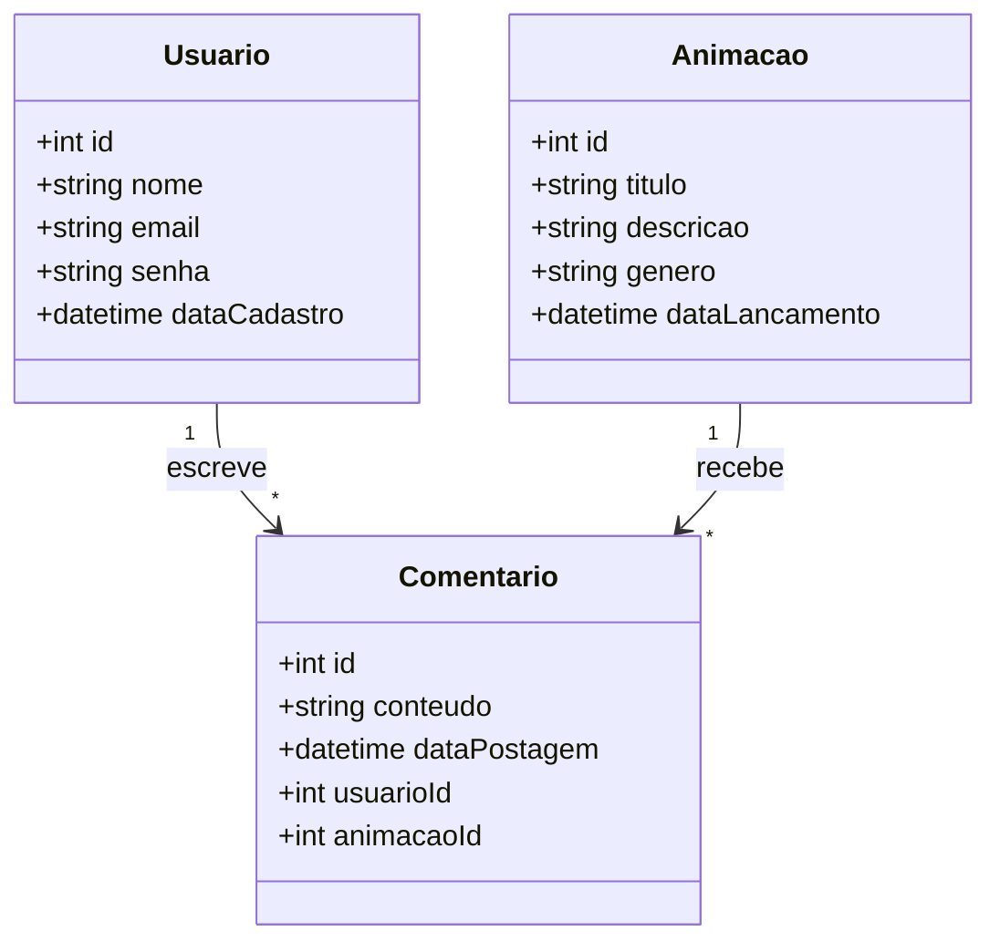

# AnimeNavs

AnimeNavs is a web application that allows users to browse and discover various anime series. The application provides detailed information about each anime, including its title, description, and rating.

## Features

- **Anime List**: Browse a list of anime series with images and titles.
- **Anime Details**: View detailed information about each anime, including its description and rating.
- **Responsive Design**: The application is designed to be responsive and works well on both desktop and mobile devices.

## Installation

To run this project locally, follow these steps:

1. **Clone the repository**:
    ```bash
    git clone https://github.com/yourusername/animenavs.git
    cd animenavs
    ```

2. **Install dependencies**:
    ```bash
    npm install
    ```

3. **Start the development server**:
    ```bash
    npm start
    ```

The application will be available at `http://localhost:3000`.

## Project Structure

The project structure is as follows:

```
c:\www\animenavs\
├── public\
│   ├── index.html
│   └── ...
├── src\
│   ├── components\
│   │   ├── Header\
│   │   ├── Footer\
│   │   └── Cards\
│   │       └── Cards.module.css
│   ├── json\
│   │   └── animes.json
│   ├── pages\
│   │   └── Anime\
│   │       ├── index.js
│   │       └── Anime.module.css
│   ├── App.js
│   └── index.js
└── package.json
```

## Components

### Header

The `Header` component is used to display the navigation bar at the top of the application.

### Footer

The `Footer` component is used to display the footer at the bottom of the application.

### Cards

The `Cards` component is used to display a list of anime series in a card format. Each card includes an image and title of the anime.

### Anime

The `Anime` component is used to display detailed information about a specific anime. It includes the anime's image, title, description, and rating.

## Styling

The application uses CSS modules for styling. Each component has its own CSS module file to encapsulate its styles.

## Initial Class Diagram


---

# AnimeNavs

AnimeNavs é uma aplicação web que permite aos usuários navegar e descobrir várias séries de anime. A aplicação fornece informações detalhadas sobre cada anime, incluindo seu título, descrição e classificação.

## Funcionalidades

- **Lista de Animes**: Navegue por uma lista de séries de anime com imagens e títulos.
- **Detalhes do Anime**: Veja informações detalhadas sobre cada anime, incluindo sua descrição e classificação.
- **Design Responsivo**: A aplicação é projetada para ser responsiva e funciona bem tanto em dispositivos desktop quanto móveis.

## Instalação

Para executar este projeto localmente, siga estas etapas:

1. **Clone o repositório**:
    ```bash
    git clone https://github.com/yourusername/animenavs.git
    cd animenavs
    ```

2. **Instale as dependências**:
    ```bash
    npm install
    ```

3. **Inicie o servidor de desenvolvimento**:
    ```bash
    npm start
    ```

A aplicação estará disponível em `http://localhost:3000`.

## Estrutura do Projeto

A estrutura do projeto é a seguinte:

```
c:\www\animenavs\
├── public\
│   ├── index.html
│   └── ...
├── src\
│   ├── components\
│   │   ├── Header\
│   │   ├── Footer\
│   │   └── Cards\
│   │       └── Cards.module.css
│   ├── json\
│   │   └── animes.json
│   ├── pages\
│   │   └── Anime\
│   │       ├── index.js
│   │       └── Anime.module.css
│   ├── App.js
│   └── index.js
└── package.json
```

## Componentes

### Header

O componente `Header` é usado para exibir a barra de navegação no topo da aplicação.

### Footer

O componente `Footer` é usado para exibir o rodapé na parte inferior da aplicação.

### Cards

O componente `Cards` é usado para exibir uma lista de séries de anime em formato de cartão. Cada cartão inclui uma imagem e o título do anime.

### Anime

O componente `Anime` é usado para exibir informações detalhadas sobre um anime específico. Inclui a imagem, título, descrição e classificação do anime.

## Estilização

A aplicação usa módulos CSS para estilização. Cada componente tem seu próprio arquivo de módulo CSS para encapsular seus estilos.

